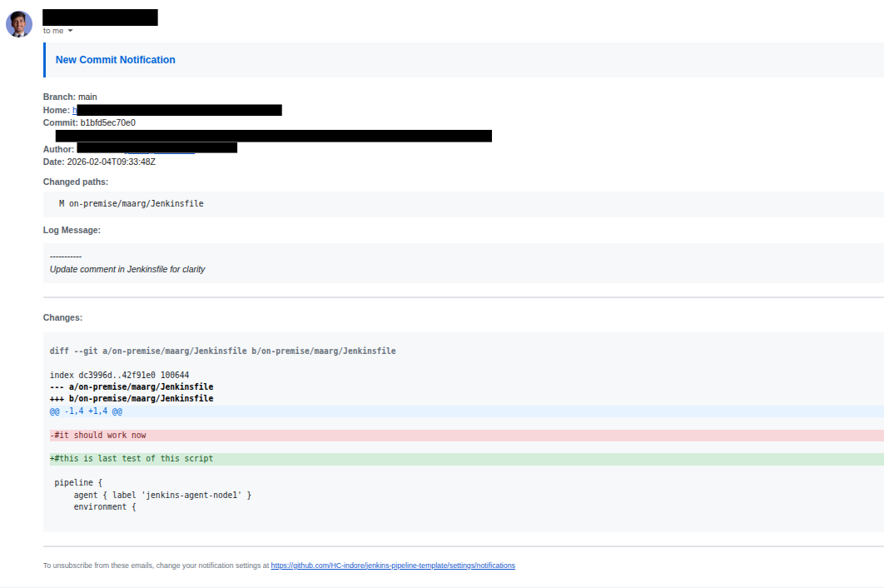

# GitHub Commit Diff Email Notifier

Send beautiful **GitLab-style** commit notification emails for your GitHub repositories. When developers push code, your team receives emails showing actual code changes with green/red highlighting - just like GitLab does!



## 🎯 Problem Solved

GitHub's default commit notifications only provide links to view changes. This tool brings GitLab's superior email notification experience to GitHub by including actual code diffs with color highlighting directly in your emails.

### Before (GitHub default):
```
Branch: refs/heads/main
Commit: f11d0c0937d
[Link to view changes]
```

### After (with this tool):
```
Branch: main
Commit: f11d0c0937d
Changed paths:
  M src/services/payment.js

[Beautiful color-coded diff showing exact changes]
+ Added lines in green
- Removed lines in red
```

## ✨ Features

- ✅ GitLab-style diff visualization with color highlighting
- ✅ Shows added lines in green, removed lines in red
- ✅ Rich HTML email formatting
- ✅ Complete commit metadata (author, date, branch, files changed)
- ✅ Handles multiple commits in a single push
- ✅ Secure webhook verification with HMAC signatures
- ✅ Docker support for easy deployment
- ✅ Works with AWS SES, Gmail, SendGrid, or any SMTP provider

## 🚀 Quick Start

### Prerequisites

- Docker and Docker Compose
- GitHub repository (personal or organization)
- SMTP email service (AWS SES, Gmail, etc.)
- GitHub Personal Access Token

### 1. Clone Repository
```bash
git clone https://github.com/YOUR_USERNAME/github-diff-emailer.git
cd github-diff-emailer
```

### 2. Configure Environment
```bash
# Copy example environment file
cp .env.example .env

# Edit with your credentials
nano .env
```

**Required configuration:**
```bash
# SMTP Settings (AWS SES example)
SMTP_SERVER=email-smtp.us-east-1.amazonaws.com
SMTP_PORT=587
SMTP_USERNAME=your_aws_ses_username
SMTP_PASSWORD=your_aws_ses_password

# Email addresses
FROM_EMAIL=notifications@yourcompany.com
TO_EMAIL=team@yourcompany.com

# GitHub token (with 'repo' scope)
GITHUB_TOKEN=ghp_xxxxxxxxxxxxxxxxxxxx

# Webhook secret (generate random string)
WEBHOOK_SECRET=$(openssl rand -hex 32)
```

### 3. Start Service
```bash
# Start with Docker Compose
docker-compose up -d

# Check logs
docker-compose logs -f

# Verify health
curl http://localhost:5000/health
```

### 4. Configure GitHub Webhook

**For Organization (all repos):**
1. Go to: `https://github.com/organizations/YOUR_ORG/settings/hooks`
2. Click **"Add webhook"**
3. Configure:
   - **Payload URL:** `https://your-server.com/webhook`
   - **Content type:** `application/json`
   - **Secret:** (paste your WEBHOOK_SECRET)
   - **Events:** Select "Just the push event"
   - **Active:** ✅ Checked
4. Click **"Add webhook"**

**For Single Repository:**
1. Go to: `https://github.com/YOUR_USER/YOUR_REPO/settings/hooks`
2. Follow same steps as above

### 5. Test It!
```bash
# Make a commit to any monitored repository
git commit --allow-empty -m "Test: Webhook notification"
git push

# Check your email! 📧
```

## 📖 Documentation

### Email Providers Setup

<details>
<summary><b>AWS SES (Recommended)</b></summary>

1. **Create SMTP Credentials:**
   - Go to AWS Console → SES → SMTP Settings
   - Click "Create SMTP Credentials"
   - Copy username and password

2. **Verify Email/Domain:**
   - Go to SES → Verified Identities
   - Verify your FROM_EMAIL address or domain

3. **Request Production Access** (if in sandbox):
   - SES → Account dashboard → Request production access
   - Usually approved in 24 hours

**Configuration:**
```bash
SMTP_SERVER=email-smtp.us-east-1.amazonaws.com  # Change region if needed
SMTP_PORT=587
SMTP_USERNAME=AKIA...
SMTP_PASSWORD=your_password
```

</details>

<details>
<summary><b>Gmail</b></summary>

1. **Enable 2-Step Verification** on your Google account
2. **Create App Password:**
   - Google Account → Security → 2-Step Verification → App passwords
   - Generate password for "Mail"

**Configuration:**
```bash
SMTP_SERVER=smtp.gmail.com
SMTP_PORT=587
SMTP_USERNAME=your-email@gmail.com
SMTP_PASSWORD=your_app_password  # NOT your regular password!
```

</details>

<details>
<summary><b>SendGrid</b></summary>

1. Create SendGrid account and API key
2. Use API key as password

**Configuration:**
```bash
SMTP_SERVER=smtp.sendgrid.net
SMTP_PORT=587
SMTP_USERNAME=apikey
SMTP_PASSWORD=your_sendgrid_api_key
```

</details>

### GitHub Token Setup

1. Go to: https://github.com/settings/tokens
2. Click **"Generate new token (classic)"**
3. Name: `GitHub Diff Emailer`
4. Scopes: Check **only** `repo` (Full control of private repositories)
5. Generate and copy the token

### Deployment Options

<details>
<summary><b>Local Development (with ngrok)</b></summary>
```bash
# Start service
docker-compose up -d

# Install ngrok (https://ngrok.com/download)
ngrok http 5000

# Use ngrok URL in GitHub webhook
# Example: https://abc123.ngrok-free.app/webhook
```

</details>

<details>
<summary><b>Production Server (Ubuntu/Debian)</b></summary>
```bash
# Install Docker
sudo apt update
sudo apt install -y docker.io docker-compose

# Clone repository
git clone https://github.com/YOUR_USERNAME/github-diff-emailer.git
cd github-diff-emailer

# Configure
cp .env.example .env
nano .env

# Start service
sudo docker-compose up -d

# Add nginx reverse proxy + SSL (optional but recommended)
sudo apt install -y nginx certbot python3-certbot-nginx
# ... configure nginx ...
```

</details>

<details>
<summary><b>AWS ECS/Fargate</b></summary>
```bash
# Push to ECR
aws ecr create-repository --repository-name github-diff-emailer
docker tag github-diff-emailer:latest <account-id>.dkr.ecr.us-east-1.amazonaws.com/github-diff-emailer
docker push <account-id>.dkr.ecr.us-east-1.amazonaws.com/github-diff-emailer

# Create ECS task definition with environment variables
# Create ECS service with ALB
# Use ALB DNS as webhook URL
```

</details>

## 🔧 Customization

### Change Email Template

Edit `github_diff_emailer.py` → `create_email_body()` method to customize HTML template.

### Change Diff Colors

Edit `github_diff_emailer.py` → `format_diff_html()` method:
```python
# Green for additions
'<span style="background-color: #d4edda; color: #155724;">...'

# Red for deletions
'<span style="background-color: #f8d7da; color: #721c24;">...'
```

### Filter by Branch

Edit `webhook_server.py` → `handle_webhook()`:
```python
branch = ref.split('/')[-1]
if branch not in ['main', 'master', 'production']:
    return jsonify({'message': f'Ignored branch: {branch}'}), 200
```

### Multiple Recipients

In `.env`:
```bash
TO_EMAIL=dev-team@company.com,ceo@company.com,leads@company.com
```

Or use a mailing list:
```bash
TO_EMAIL=git-commits@company.com  # Distribution list with all team members
```

## 🐛 Troubleshooting

### Webhook not triggering

**Check:**
```bash
# 1. Is server accessible from internet?
curl https://your-server.com/health

# 2. Check GitHub webhook deliveries
# GitHub → Settings → Webhooks → Recent Deliveries

# 3. Check Docker logs
docker-compose logs --tail=50
```

### Authentication failed

**Error:** `(535, b'Authentication Credentials Invalid')`

**Solutions:**
- Verify SMTP credentials are correct
- For AWS SES: Ensure credentials are for correct region
- For Gmail: Use app-specific password, not regular password
- Check for special characters in password (quote them in docker-compose.yml)

### Email not received

**Check:**
- FROM_EMAIL is verified in email provider
- If using AWS SES sandbox: TO_EMAIL must also be verified
- Check spam folder
- View AWS SES sending statistics for bounces

### Special characters in SMTP password

If your SMTP password contains special characters like `+`, `&`, `%`:

**Option 1:** Use `docker-compose.yml` environment variables directly:
```yaml
environment:
  SMTP_PASSWORD: "your-password-with-special-chars"
```

**Option 2:** Create new SMTP credentials without special characters

## 📊 Architecture
```
Developer Push → GitHub → Webhook → Your Server → GitHub API → Format Email → SMTP → Team Inbox
```

**Components:**
- **webhook_server.py**: Flask server receiving GitHub webhooks
- **github_diff_emailer.py**: Core email generation logic
- **Docker**: Containerization for easy deployment
- **GitHub API**: Fetches commit details and diffs
- **SMTP**: Sends formatted emails

## 🔒 Security

- ✅ Webhook signature verification (HMAC-SHA256)
- ✅ Environment-based secrets (no hardcoded credentials)
- ✅ HTTPS/TLS for email transmission
- ✅ Minimal GitHub token permissions (read-only)
- ✅ Docker container isolation

## 🤝 Contributing

Contributions are welcome! Please:

1. Fork the repository
2. Create a feature branch
3. Make your changes
4. Submit a pull request

## 📝 License

MIT License - Feel free to use and modify for your needs.

## 🙏 Acknowledgments

Created to bring GitLab's superior commit notification experience to GitHub organizations.

## 📧 Support

- **Issues:** [GitHub Issues](https://github.com/YOUR_USERNAME/github-diff-emailer/issues)
- **Discussions:** [GitHub Discussions](https://github.com/YOUR_USERNAME/github-diff-emailer/discussions)

---

**Enjoy GitLab-quality notifications in GitHub!** ⭐ Star this repo if it helps you!
